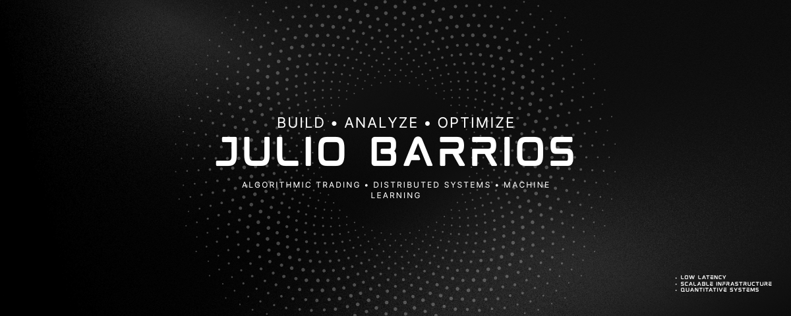

<!-- BANNER PRINCIPAL -->
<p align="center">
  
</p>


<p align="center">
<a href="https://www.linkedin.com/in/julio-ricardo-barrios-amador/"></a>&nbsp;
<a href="https://github.com/JuliobaCR"></a>&nbsp;
<a href="mailto:barriosamadorjulioricardo@gmail.com"></a>&nbsp;
<a href="https://x.com/JuliobaCR"></a>&nbsp;
<a href="https://discord.com/users/julioba"></a>
</p>

<div align="center">
  
  <p align="center">
    
    &nbsp;
    
    &nbsp;
    
  </p>
</div>

---

<!-- SECCIÓN: SOBRE MÍ (DISEÑO TIPO TERMINAL MODERNO) -->
## ─── ❖ ───  `> whoami`  ─── ❖ ───

<p>
👋 ¡Hola! Soy <b>Julio Ricardo Barrios Amador</b>, estudiante de Ingeniería en Computación en el <b>Instituto Tecnológico de Costa Rica (TEC)</b>. Me apasiona la intersección entre las finanzas cuantitativas, los sistemas distribuidos de baja latencia y la arquitectura de software robusta.
</p>

*   **Liderazgo:** Representante de Estudiantes de la Sección de IEEE Costa Rica (SSR) & Vocal 2 en IEEE Computer Society TEC.
*   **Enfoque:** Construir sistemas de alto rendimiento que operen con precisión milimétrica, optimizando latencia, extrayendo *alpha* y modelando riesgo.
*   **Targeting:** Apuntando firmemente hacia roles de ingeniería de software y quant research en firmas líderes globales.

---

## 📈 DOMINIOS CORE & INTERESES

<div align="center">
  <table border="0">
    <tr>
      <td width="33.3%" valign="top">
        <h3>📊 Finanzas Cuantitativas</h3>
        <ul>
          <li>Trading Algorítmico</li>
          <li>High-Frequency Trading (HFT)</li>
          <li>Estrategias Momentum & StatArb</li>
          <li>Análisis de Riesgo de Portafolio</li>
        </ul>
      </td>
      <td width="33.3%" valign="top">
        <h3>🖥️ Ingeniería de Sistemas</h3>
        <ul>
          <li>Sistemas Distribuidos</li>
          <li>Arquitectura Backend de Alta Carga</li>
          <li>Infraestructura de Blockchain</li>
          <li>Computación de Alto Rendimiento</li>
        </ul>
      </td>
      <td width="33.3%" valign="top">
        <h3>🧠 IA & Modelado</h3>
        <ul>
          <li>Machine Learning en Finanzas</li>
          <li>Procesamiento de Series Temporales</li>
          <li>Microestructura de Mercado</li>
          <li>Modelado Estadístico</li>
        </ul>
      </td>
    </tr>
  </table>
</div>

---

## 🛠️ ARSENAL TECNOLÓGICO

<div align="center">

| Categoría | Tecnologías y Herramientas |
| :--- | :--- |
| **Lenguajes** |       |
| **Backend & Infra** |      |
| **Frontend** |    |
| **Trading & Web3** |    |

</div>

---

## 🔬 SISTEMAS DESTACADOS


<div align="center">
<table border="0">
<tr>
<td width="50%" valign="top">

### 🔗 TrulyLedger
*Infraestructura blockchain para la verificación de contratos digitales en la red Stellar.*
* 🛠️ **Tech:** Stellar, TypeScript, Node.js
* ▹ Arquitectura de seguridad de grado financiero con pistas de auditoría inmutables.
* ▹ Pipelines automatizados y optimizados para validación de contratos.
</td>
<td width="50%" valign="top">

### 📊 Quant Trading Systems
*Motores de trading algorítmico y modelos de ejecución de mercado.*
* 🛠️ **Tech:** Python, MetaTrader 5, Backtesting
* ▹ Modelos analíticos de riesgo integrados y captura de señales en tiempo real.
* ▹ Algoritmos aplicados en mercados de criptomonedas y futuros.
</td>
</tr>
<tr>
<td width="50%" valign="top">

### 🎮 Gathel
*Plataforma de gaming basada en predicciones y resolución de eventos mediante IA.*
* 🛠️ **Tech:** NestJS, AI, React
* ▹ Capa de verificación social con infraestructura escalable orientada a Web3.
* ▹ Motores de IA dedicados al análisis de veracidad y resolución de disputas.
</td>
<td width="50%" valign="top">

### 🌐 IEEE Event Platforms
*Plataformas full-stack escalables para la gestión de comunidades técnicas.*
* 🛠️ **Tech:** React Native, Next.js, PostgreSQL
* ▹ Aplicaciones móviles y web desplegadas en capítulos activos de la región.
* ▹ Soportando cargas e interacción activa de más de 1000 ingenieros.
</td>
</tr>
</table>
</div>

---

## 📡 MÉTRICAS DEL SISTEMA

<div align="center">
  
  &nbsp;&nbsp;
  
  
  <br/><br/>
  
</div>

---

## 🔭 OBJETIVOS EN EJECUCIÓN

```python
# Estado del Ingeniero
ambition = "max"
latency  = "min"
alpha    = "positive"

# Enfoques principales actuales
current_focus = [
    "📐 Perfeccionar matemáticas quant: cálculo estocástico y microestructura de mercado",
    "⚙️  Diseñar e implementar motores de ejecución y OMS de ultra baja latencia",
    "🧬 Desarrollar pipelines de ML para el procesamiento y extracción de señales alpha",
    "📊 Backtesting riguroso de estrategias cuantitativas (Momentum & StatArb)"
]

# Tecnologías en profundización activa
learning_stack = ["C++ High-Performance", "Rust", "Options Pricing (BSM)", "Kubernetes"]